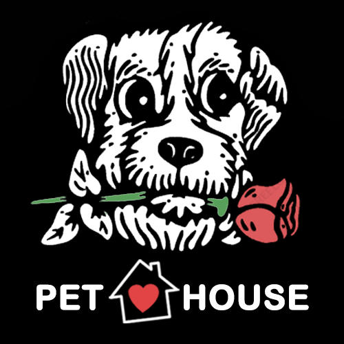

# Final Project Web Pet House
Using HTML, CSS, Javascript language to develop, Use Mysql as a Database and Uses React + TailwindCSS Framework. Consists of Main Systems Post looking for a home for a pet., Post a Pet Lost, Contribution, Chat, CRUD and Sales System + Shopping Cart.

  

# Screens it contains

 => Register / Login 

 => Systems Post looking for a home for a pet 

 => Post a Pet Lost 

 => Contribution 

 => Chat Room 

 => CRUD / Admin / Dashboard 

 => Sales System + Shopping Cart 

 => Help Post 

 => Predict type and species from animal pictures 

# Backend
https://github.com/CSgx333/Pet-House-Backend
